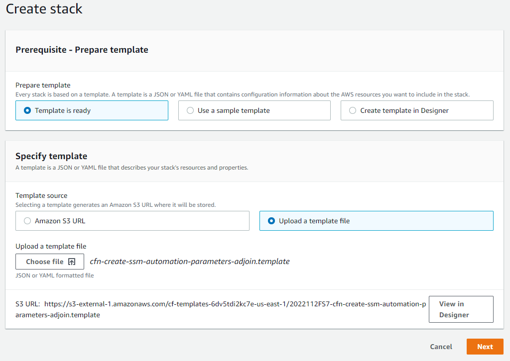
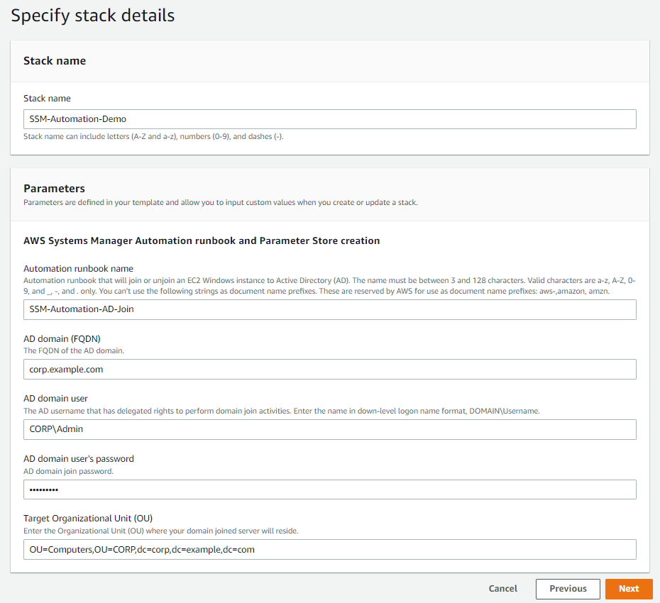

# Overview
Deploy a custom AWS Systems Manager Automation runbook that automatically domain joins or unjoin from an Active Directory (AD) domain. This runbook can be used with on-premises AD or AWS Managed Microsoft AD and can be executed manually or automatically with services such as Amazon EventBridge or AWS Lambda. The runbook leverages parameters stored in AWS Systems Manager Parameter Store. In particular, 4 parameters are created that include the AD domain name, AD domain username, AD domain user's password, and a specific Organizational Unit (OU) in AD.

# Deploy the Automation runbook and parameters
To deploy the runbook and parameters, download the AWS CloudFormation template from Github, **cfn-create-ssm-automation-parameters-adjoin.template**, and create a new CloudFormation stack. Using the stack will simplify the deploy of the Automation runbook and create the appropriate parameters to perform th eAD join/unjoin activities. To learn more about CloudFormation stack creation, visit the [AWS documentation](https://docs.aws.amazon.com/AWSCloudFormation/latest/UserGuide/GettingStarted.Walkthrough.html#GettingStarted.Walkthrough.createstack).

## Creating a stack in CloudFormation

## Example of stack details configured for an Automation runbook creation and parameters. NOTE: the password is hidden and created as a SecureString.

# Parameter Store
The Automation runbook requires parameters stored in Systems Manager Parameter Store to complete the domain join and unjoining activities. This includes the AD domain name (FQDN), AD username, AD password, and a targetOU. To learn more about Parameter Store, visit the [AWS documentation](https://docs.aws.amazon.com/systems-manager/latest/userguide/systems-manager-parameter-store.html).

The following parameters are created by the CloudFormation template (NOTE: the parameter names and values are cAsE-SeNsItIvE):

## AD domain name
- **Name** : *domainName*
- **Type** : String
- **Data type** : text
- **Value** : *corp.example.com*

## AD user with domain join rights
- **Name** : *domainJoinUserName*
- **Type** : String
- **Data type** : text
- **Value** : *CORP\domainadmin*

## AD user password
*Requires an AWS KMS key*
- **Name** : *domainJoinPassword*
- **Type** : SecureString
- **Data type** : text
- **Value** : *YOURSECRET*
  - NOTE, the secret requires an AWS KMS key ID.

## Specify the target Organization Unit (OU) for the domain account.
- **Name** : *defaultTargetOU*
- **Type** : String
- **Data type** : text
- **Value** : *OU=Servers,OU=CORP,dc=corp,dc=example,dc=com*

***

# Scalability example
The CloudFormation template **cfn-deploy-ec2launchtemplate-asg-elb.template** allows customers to deploy Auto Scaling groups to build scalable architecture and leverage [launch and termination lifecycle hooks](https://docs.aws.amazon.com/autoscaling/ec2/userguide/lifecycle-hooks.html) to accomplish this. The Auto Scaling group is associated with an Elastic Load Balancer (ELB), creates an Amazon EC2 Launch Template to configures the latest Windows Server 2019 Base Amazon Machine Image (AMI) and configures IIS as a web server. Finally an Amazon EventBridge monitors events for Auto Scaling lifecycle changes, specifically the aforementioned launch and termination lifecycle hooks, to domain join or unjoin the EC2 instances in the Auto Scaling group automatically. To complete the domain join or unjoin activities, the EventBridge targets the Systems Manager Automation runbook created from **cfn-create-ssm-automation-parameters-adjoin.template**.
