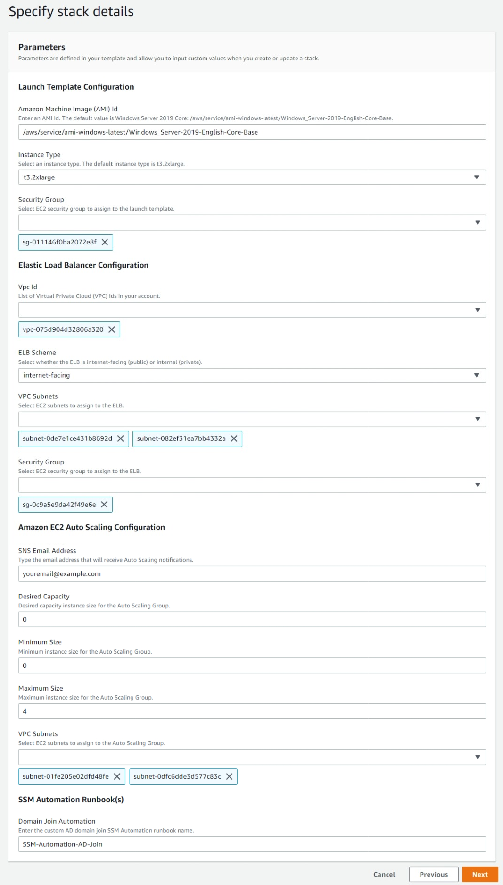

# Overview
Deploy a custom AWS Systems Manager Automation runbook that automatically domain joins or unjoin from an [Active Directory (AD) domain](https://docs.microsoft.com/en-us/windows-server/identity/ad-ds/get-started/virtual-dc/active-directory-domain-services-overview). This runbook can be used with on-premises AD, self-managed AD running on [Amazon Elastic Compute Cloud (Amazon EC2) Windows instances](https://aws.amazon.com/windows/products/ec2/), or [AWS Managed Microsoft AD](https://aws.amazon.com/directoryservice/) and can be executed manually or automatically with services such as [Amazon EventBridge](https://aws.amazon.com/eventbridge/) or [AWS Lambda](https://aws.amazon.com/lambda/). The runbook leverages parameters stored in AWS Systems Manager Parameter Store. In particular, 4 parameters are created that include the AD domain name, AD domain username, AD domain user's password, and a specific Organizational Unit (OU) in AD.

# Deploy the Automation runbook and parameters
To deploy the runbook and parameters automatically, download and save the AWS CloudFormation template from Github, [**cfn-create-ssm-automation-parameters-adjoin.template**](templates/cloudformation/cfn-create-ssm-automation-parameters-adjoin.template), and save it locally to your computer to create a new CloudFormation stack. Creating a new stack will simplify the deployment of the Automation runbook and create the appropriate parameters to perform the AD join/unjoin activities automatically. To learn more about CloudFormation stack creation, visit the [AWS documentation](https://docs.aws.amazon.com/AWSCloudFormation/latest/UserGuide/GettingStarted.Walkthrough.html#GettingStarted.Walkthrough.createstack).

To create the Automation runbook manually, you can download the template separately from [here](templates/systemsmanager/ssm-automation-domainjoinunjoin.yaml) and create a custom Automation runbook manually. Visit the AWS documentation to learn [how to create runbooks with the Document Builder](https://docs.aws.amazon.com/systems-manager/latest/userguide/automation-document-builder.html) or [how to create runbooks with the Editor](https://docs.aws.amazon.com/systems-manager/latest/userguide/automation-document-editor.html). 

## Creating a stack in CloudFormation


## Example of stack details configured for an Automation runbook creation and parameters.
The password is hidden and created as a SecureString parameter data, which is encrypted and decrypted using an AWS KMS key. Learn more by visiting [AWS documentation](https://docs.aws.amazon.com/systems-manager/latest/userguide/systems-manager-parameter-store.html#what-is-a-parameter).


***

# Parameter Store
The Automation runbook requires parameters stored in Systems Manager Parameter Store to complete the domain join and unjoining activities. If you chose to deploy the environment using the CloudFormation stack, these parameters are created automatically. Otherwise, the parameters must be created manually. This includes the AD domain name (FQDN), AD username, AD password, and a targetOU. To learn more about Parameter Store, visit the [AWS documentation](https://docs.aws.amazon.com/systems-manager/latest/userguide/systems-manager-parameter-store.html).

Below are details of the parameters that are created by the CloudFormation stack or manually if you choose not to use CloudFormation (NOTE: the parameter names and values are cAsE-SeNsItIvE).

## AD domain name
- **Name** : *domainName*
- **Type** : String
- **Data type** : text
- **Value** : *corp.example.com*

## AD user with domain join rights
- **Name** : *domainJoinUserName*
- **Type** : String
- **Data type** : text
- **Value** : *CORP\domainadmin*

## AD user password
*Requires an AWS KMS key*
- **Name** : *domainJoinPassword*
- **Type** : SecureString
- **Data type** : text
- **Value** : *YOURSECRET*
  - NOTE, the secret requires an AWS KMS key ID.

## Specify the target Organization Unit (OU) for the domain account.
- **Name** : *defaultTargetOU*
- **Type** : String
- **Data type** : text
- **Value** : *OU=Servers,OU=CORP,dc=corp,dc=example,dc=com*

***

## PowerShell

Within the Systems Manager Automation runbook there are two steps where either domain join or domain unjoin activities are executed. These steps call a [Systems Manage Command document (SSM Document)](https://docs.aws.amazon.com/systems-manager/latest/userguide/sysman-ssm-docs.html) to execute this code. Specifically, the SSM Command document that is executed is **AWS-RunPowerShellScript**, which simply executes any code that is passed as an input parameter. Below are the PowerShell code blocks used to perform domain join and domain unjoin activities, respectively.

### Domain join
```powershell
# Define AD domain specific variables. AWS Systems Manager Parameter Store is where these parameters reside.
$targetOU = (Get-SSMParameterValue -Name "defaultTargetOU").Parameters[0].Value
$domainName = (Get-SSMParameterValue -Name "domainName").Parameters[0].Value
$domainJoinUserName = (Get-SSMParameterValue -Name "domainJoinUserName").Parameters[0].Value
$domainJoinPassword = (Get-SSMParameterValue -Name "domainJoinPassword" -WithDecryption:$true).Parameters[0].Value | ConvertTo-SecureString -AsPlainText -Force
$domainCredential = New-Object System.Management.Automation.PSCredential($domainJoinUserName,$domainJoinPassword)

# Domain join check. If the server is not part of a domain (in a Windows Workgroup), then the server will be joined to the domain.
if ((Get-WmiObject -Class Win32_ComputerSystem).PartOfDomain -eq $false) {
    Add-Computer -ComputerName $env:COMPUTERNAME -DomainName $domainName -Credential $domainCredential -OUPath $targetOU -ErrorAction Stop -Restart:$false
    Write-Host "Joining $env:COMPUTERNAME to Active Directory domain: $domainName.`nMoving $env:COMPUTERNAME to the following OU: $targetOU.`n"
    exit 0
}
```

### Domain unjoin
```powershell
# Define AD domain specific variables. AWS Systems Manager Parameter Store is where these parameters reside.
$domainName = (Get-SSMParameterValue -Name domainName).Parameters[0].Value
$domainJoinUserName = (Get-SSMParameterValue -Name "domainJoinUserName").Parameters[0].Value
$domainJoinPassword = (Get-SSMParameterValue -Name "domainJoinPassword" -WithDecryption:$true).Parameters[0].Value | ConvertTo-SecureString -AsPlainText -Force
$domainCredential = New-Object System.Management.Automation.PSCredential($domainJoinUserName,$domainJoinPassword)

if (-not (Get-WindowsFeature -Name RSAT-AD-Tools).Installed) {
    Write-Host "Installing RSAT AD Tools to allow domain joining.`n"
    Add-WindowsFeature -Name RSAT-AD-Tools | Out-Null
    Write-Host "Installation of RSAT AD Tools completed.`n"
}

$getADComputer = (Get-ADComputer -Identity $env:COMPUTERNAME -Credential $domainCredential)
$distinguishedName = $getADComputer.DistinguishedName

# Domain join check
if ((Get-WmiObject -Class Win32_ComputerSystem).PartOfDomain -eq $true) {
    Write-Host "Unjoining $env:COMPUTERNAME from Active Directory domain: $domainName.`n"

    # Unjoin from AD and remove the AD computer object.'
    Remove-Computer -ComputerName $env:COMPUTERNAME -UnjoinDomaincredential $domainCredential -Verbose -Force -Restart:$false
    Remove-ADComputer -Credential $domainCredential -Identity $distinguishedName -Server $domainName -Confirm:$False -Verbose

    Write-Host "$env:COMPUTERNAME has unjoined from the $domainName domain and in a Windows Workgroup."
} else {
    Write-Host "$env:COMPUTERNAME is not part of the Active Directory domain $domainName and already part of a Windows Workgroup."
}
exit 0
```

With the exception of the parameters from the Systems Manager Parameter Store, the PowerShell script should be familiar to any admin who leverages PowerShell AD cmdlets to execute domain join activities. There are **exit codes** specific to Systems Manager, aiding in activities where restarts are required and may require continuation of the PowerShell script. Learn more about exit codes by visiting [AWS documentation](https://docs.aws.amazon.com/systems-manager/latest/userguide/command-exit-codes.html).

NOTE: this code can be customized as needed. Also, AD credentials are currently stored as parameters in Systems Manager Parameter Store. However, customers can choose to store these credentials as secrets in AWS Secrets Manager. To learn more about Secrest Manager, visit the [AWS documentation](https://docs.aws.amazon.com/secretsmanager/latest/userguide/intro.html)
***

# Scalability example
The CloudFormation template [**cfn-deploy-ec2launchtemplate-asg-elb.template**](templates/cloudformation/cfn-deploy-ec2launchtemplate-asg-elb.template) allows customers to deploy Auto Scaling groups to build scalable architecture and leverage [launch and termination lifecycle hooks](https://docs.aws.amazon.com/autoscaling/ec2/userguide/lifecycle-hooks.html) to accomplish this.

The components used in this environment are listed below.

* An Auto Scaling group is associated with an Elastic Load Balancer (ELB)
* An Amazon EC2 Launch Template is associated with the Auto Scaling group
  *  Built with the [latest Windows Server 2019 Base Amazon Machine Image (AMI)](https://aws.amazon.com/blogs/mt/query-for-the-latest-windows-ami-using-systems-manager-parameter-store/)
  *  Userdata configures IIS as a web server per EC2 instance
* An [Amazon EventBridge](https://docs.aws.amazon.com/eventbridge/latest/userguide/eb-what-is.html) monitors events for Auto Scaling lifecycle changes
  * Specifically, [EventBridge reacts to launch and termination lifecycle hooks](https://docs.aws.amazon.com/autoscaling/ec2/userguide/cloud-watch-events.html) to domain join or unjoin, respectively, an EC2 instances in the Auto Scaling group to AD automatically
* To complete the domain join or unjoin activities, the EventBridge targets the Systems Manager Automation runbook created from [**ssm-automation-domainjoinunjoin-with-autoscaling-lifecycle.yaml**](templates/systemsmanager/ssm-automation-domainjoinunjoin-with-autoscaling-lifecycle.yaml)

The Auto Scaling group is currently configured for manual scaling, i.e. an AWS admin will have to change the desired capacity and minimum capacity. This is done for demo purposes and to demonstrate how the power of Systems Manager Automation when incorporated with event-driven services like Amazon EC2 Auto Scaling and Amazon EventBridge to build scalable architectures in AWS. Customers can use this as a building block for their AD environments hosted in AWS and build even more complex workflows where appropriate. Please note, automatic scaling through Amazon CloudWatch/EventBridge can be configured as needed in Auto Scaling as needed.

## Example of stack details configured to create an Amazon EC2 Launch Template, Elastic Load Balancer, Auto Scaling group, and the name of the Automation runbook created earlier.

